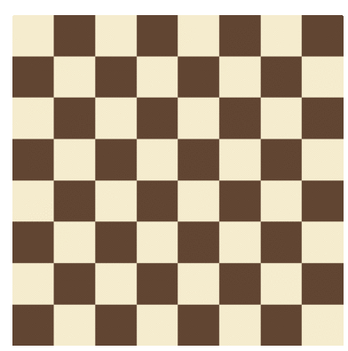

# Constraint Satisfaction

Constraint Satisfaction is a technique for solving problems by expressing limits on the values of each variable in the solution with mathematical constraints. This work implementing [Scipy](https://www.scipy.org/) to explicitly construct binary constraints and then use Backtracking to solve the N-queens problem (which is a generalization [8-queens problem](https://en.wikipedia.org/wiki/Eight_queens_puzzle)). 

Briefly, the 8-queens problem asks you to place 8 queens on a standard 8x8 chessboard such that none of the queens are in "check" (i.e., no two queens occupy the same row, column, or diagonal). The N-queens problem generalizes the puzzle to to any size square board.